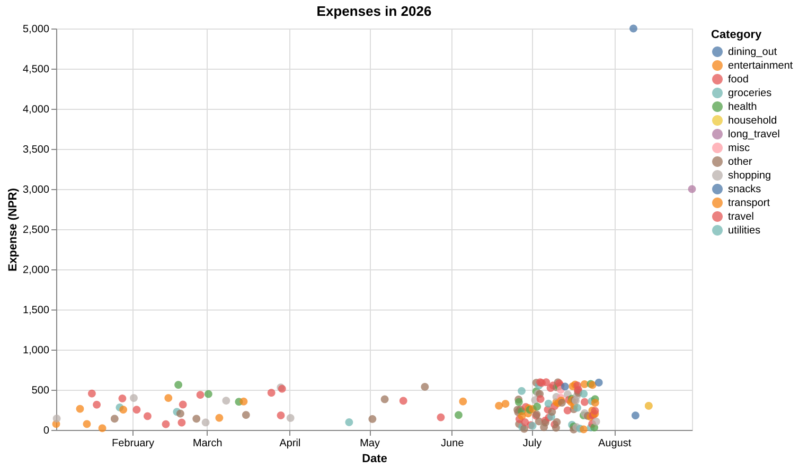

Giving an agent the ability to plot something usually means handing it a plotting
library and hoping the code it writes is safe. Code Mode plus Vega-Lite is a
tighter fit: the model writes its analysis code inside a sandbox, then emits the
chart as a JSON spec that gets rendered outside it.

### Motivation
- Say a user needs to make charts after doing some light data analysis.
- Need to run the analysis and charting code in a sandboxed environment, so that the model can generate the chart without having access to the filesystem or network.
- For this we can use CodeMode, which allows the model to write code in a sandboxed environment (here: Monty).
- For Charting, we can turn Matplotlib into a tool, but this is not a clean solution, and may raise security issues with model writing arbitrary code.
- Vega-Lite is a good alternative: specs are plain JSON, and should be in model training data.

### Background
[Code Mode](https://blog.cloudflare.com/code-mode/): allow agents to write code instead of the usual tool calling, which allows for a more expressive and efficient operation.  
[Monty](https://github.com/pydantic/monty): A minimal sandbox for running python. Used by pydantic-ai's CodeMode.  
[Vega-Lite](https://vega.github.io/vega-lite/): A JSON grammar for declaratively defining charts.  


> You also need a tool to get the data from, for me I have a tool that allows models to run DB queries. (With timeouts and only read access ofc)


> And a tool to pass the generated json into Vega-Lite Converter, which converts the spec into an image

### How it works
You can combine all these items into a flow like this  

**Message**: Scatter plot of all my expenses with labels on the biggest ones  

> *Now the model does a series of tool calls by writing code in CodeMode, and the final output is a chart.*

> Model first loads the data

```python
rows = await query_database(query="""SELECT date, amount, title
FROM transactions
WHERE is_expense = TRUE
ORDER BY date ASC
LIMIT 500""")
rows
```

> Once it sees the underlying structure, it can add some light code to transform the data in the correct format and generate the chart like such.
> On the next code generation `rows` from initial call is accessible.

```python
sorted_rows = sorted(rows, key=lambda r: r['amount'], reverse=True)
top_ids = set(id(r) for r in sorted_rows[:10])
values = []
for r in rows:
    values.append({
        'date': r['date'],
        'amount': r['amount'],
        'title': r['title'],
        'label': r['title'] if id(r) in top_ids else None,
    })
spec = {
    'title': 'All expenses',
    'width': 600,
    'height': 380,
    'data': {'values': values},
    'layer': [
        {
            'mark': {'type': 'point', 'filled': True, 'size': 65, 'opacity': 0.75},
            'encoding': {
                'x': {'field': 'date', 'type': 'temporal', 'title': 'Date'},
                'y': {'field': 'amount', 'type': 'quantitative', 'title': 'Expense (NPR)'},
                'tooltip': [
                    {'field': 'date', 'type': 'temporal', 'title': 'Date'},
                    {'field': 'title', 'type': 'nominal', 'title': 'Expense'},
                    {'field': 'amount', 'type': 'quantitative', 'title': 'NPR'}
                ]
            }
        },
        {
            'transform': [{'filter': 'datum.label != null'}],
            'mark': {'type': 'text', 'align': 'left', 'dx': 6, 'dy': -6, 'fontSize': 10},
            'encoding': {
                'x': {'field': 'date', 'type': 'temporal'},
                'y': {'field': 'amount', 'type': 'quantitative'},
                'text': {'field': 'label', 'type': 'nominal'}
            }
        }
    ]
}
await plot_chart(spec=spec)
```

### Plot Chart Function

The `plot_chart` function looks like this.

```python
async def plot_chart(ctx: RunContext[HandleAttachments], spec: dict[str, Any]) -> str:
    """Render a Vega-Lite v5 spec and send the chart to the user.

    Args:
        spec: The full Vega-Lite v5 spec, with the rows inline, e.g.
            {"title": "Expenses by category",
             "width": 600,
             "data": {"values": [{"category": "food", "amount": 10868.6},
                                 {"category": "transport", "amount": 5843.0}]},
             "mark": "bar",
             "encoding": {
                 "y": {"field": "category", "type": "nominal", "sort": "-x"},
                 "x": {"field": "amount", "type": "quantitative",
                       "title": "Spend (NPR)"}}}
    """
    if isinstance(spec.get("data"), dict) and "url" in spec["data"]:
        # URL fetch can make it unsafe
        return "Chart not rendered: put the rows inline in data.values, not a url."

    try:
        # to_thread: No blocking the event loop.
        png = await asyncio.to_thread(
            vlc.vegalite_to_png, json.dumps(spec), scale=2
        )
    except Exception as exc:  # an invalid spec: hand the message back for a retry
        return f"Chart not rendered: {exc}"

    # attachments send to output channel.
    ctx.deps.attach(f"chart-{len(ctx.deps.attachments) + 1}.png", png)
    return "Chart sent to the user."
```

Any invalid spec can be fed back to the model itself, creating a self correcting loop.

### Example Output


### Safety Guarantees for Chart
- Code runs in monty, with safety guarantees like no access to filesystem, network or library imports apart from a limited set.
- Passing the rendering to matplotlib or something similar would make the solution
  - either be less expressive
  - or, less safe
- Vega-Lite allows for
  - URL param for the data, which is explicitly disabled
    - Model can send requests to arbitrary internal and external urls, which can leak internal data.
  - Also has sandboxed expression language for the renderer, with no network / file system access.

### Limitations
- System that need more expressive charts than a png will need to build their own renderer and specs.
