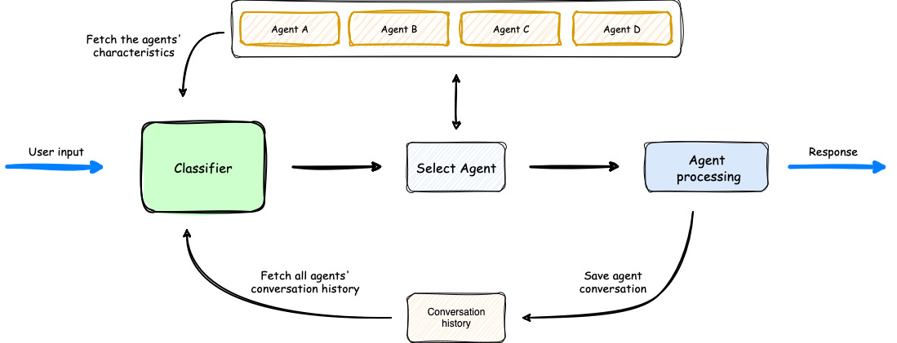
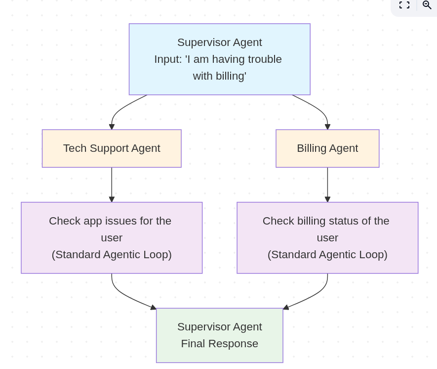

[AWS Agent Squad](https://github.com/awslabs/agent-squad) is a light weight framework for orchestrating AI Agents.

### Basic Architecture

Most AI Agent orchestration frameworks are just ways of calling a LLM in a loop to achieve neat behavior.
Here is what makes different

#### Runner / Orchestration Class
This class is relatively smaller than something like [OpenAI's swarm](https://github.com/openai/swarm) architecture.
*i have yet to read about [OpenAI's  agents](https://github.com/openai/openai-agents-python) but i assume the structure is similar*
It consists of 
- A router LLM call which uses the history and input to either route to a new `agent` or use the previously used agent 
- It then dispatches the input as a request using `agent.process_request()`
- It has the appropriate steam handing and LLM history logic.  (which i glossed over)

#### Agent Class
The thing that separates it from OpenAI's architecture is that the Agent class the the loop.
This loop is pretty standard and is of the form 
```python
prepare_history()
keep_running = True
while keep_running and interations < max_iterations
	stream, tool_calls = llm_call()
	async for chunk in stream:
		yield stream

	if tool_calls:
		perform_tool_in_parallel()
	else:
		keep_running = False
```
Now having this look gives it own ability which is kinda harder to achieve in OpenAI's swarm like structure.
That is: a easy implementation of  the "Supervisor Agent".

#### Supervisor Agent
The supervisor agent implements a parallel task assignment (to Agents) and gathering of the  results for final output.  
Using one of their own examples, this is what would be the flow of a user query.


Here the two agents can run in parallel, performing their respective duties, with 0 knowledge of the other agent.

#### Memory and context management
🚧 To read about it tomorrow
