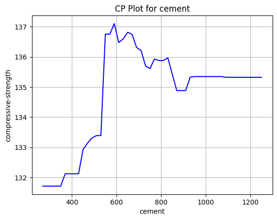
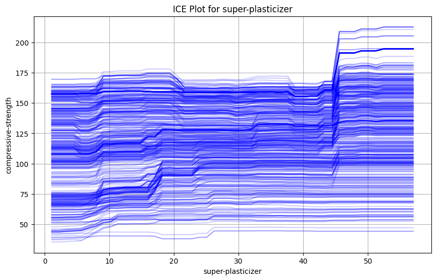
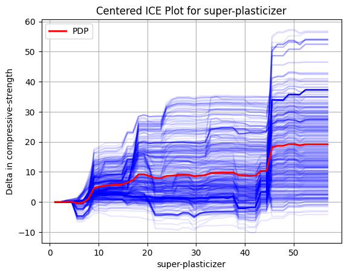

> Local Model Agnostic Method

## Ceteris Paribus
**Ceteris Paribus (CP)** is Latin for *keeping all things equal*. It is one of the simplest plot. 
Here, we look at only *one* of the data sample, and only one parameter of the data at a time.  
Then we systematically very the value, (generally from the minimum to the maximum value in the dataset.) to get a insight on how the model's prediction changes with the change in the the parameter.  

An example implementation will look something like this
```python
import matplotlib.pyplot as plt
import numpy as np
import pandas as pd
def generate_cp_plot(model, X: pd.DataFrame, index: int, feature: str, predicted_feature_name: str):
    """Generate CP plot for a given feature.
	The index represents the row from the data frame
    """
    min_value = X[feature].min()
    max_value = X[feature].max()
    value_range = np.linspace(min_value, max_value, 50)

    pc_plot_root_data = X.iloc[index].copy()
    pc_plot_rows = []
    for v in value_range:
        row = pc_plot_root_data.copy()
        row[feature] = v
        pc_plot_rows.append(row)
	
    pc_df = pd.DataFrame(pc_plot_rows)
    predictions = model.predict(pc_df)
    plt.plot(value_range, predictions, color='blue')
	
    plt.xlabel(feature)
    plt.ylabel(predicted_feature_name)
    plt.title(f'CP Plot for {feature}')
    plt.grid()
    plt.show()
```

This is an example of a simple `CP` plot for the change of compressive strength when we change the cement content. A random forest regressor was used as the model.
### Things to consider
While this method thrives because of its simplicity, it is very easy to create *unrealistic data.*  This is especially true when features are correlated. 
Say for example, we have two features, weight and size of a animal. If we increase the weight while keeping the size the same, it could indicate non realistic data.
This is exemplified when there are more features. Say we have features :$F_1, F_2, and F_3$. where the first two are numeric and the third is categorical.
($f_1, f_2$)  as a pair might make sense, but with the combination of ($f_1, f_2, f_3$) might not be realistic. Say increasing the temperature to above 30 C, but keeping the class as Winter. As such when using this technique one should remember to 
- Remember about the possible correlation with the features
- Not to over interpret strong reduction / increase from the base value
## Individual Conditional Expectations
> Extension of CP plot

A combined CP plot for the entire dataset.

This shows a simple ICE plot showcasing the change of compressive strength of cement as we change the amount of super-plasticizer.
While the entire dataset can be a little over whelming, we can observe a general upward trend on the data.
Here is a simple python implementation for the same.
```python
import matplotlib.pyplot as plt
import numpy as np
import pandas as pd

def generate_ice_plot(model, X_train: pd.DataFrame, feature: str, predicted_feature_name: str = "compressive-strength", alpha: float = 0.3):
    plt.figure(figsize=(10, 6))
    """Generate ICE plot for a given feature."""
    min_value = X_train[feature].min()
    max_value = X_train[feature].max()
    value_range = np.linspace(min_value, max_value, 50)

    for i in range(len(X_train)):
        pc_plot_root_data = X_train.iloc[i].copy()
        pc_plot_rows = []
        for v in value_range:
            row = pc_plot_root_data.copy()
            row[feature] = v
            pc_plot_rows.append(row)
        
        pc_df = pd.DataFrame(pc_plot_rows)
        predictions = model.predict(pc_df)
        plt.plot(value_range, predictions, color='blue', alpha=alpha)
    
    plt.xlabel(feature)
    plt.ylabel(predicted_feature_name)
    plt.title(f'ICE Plot for {feature}')
    plt.grid()
    plt.show()
```
This ICE plot does have one limitation in that each curve starts at **different points**. So one variation on it is the `centered ICE plot` in which each point starts at the same point. This point is the *anchor* and we subtract this value from all predictions for the data point.
Here is another simple python implementation
```python
import numpy as np
import pandas as pd

def generate_centered_ice_plot(model, X_train: pd.DataFrame, feature: str, predicted_feature_name: str = "compressive-strength", alpha=0.3, add_pdp=False):
    """Generate ICE plot for a given feature."""
    min_value = X_train[feature].min()
    max_value = X_train[feature].max()
    value_range = np.linspace(min_value, max_value, 50)

    list_of_list_of_delta : list[list[float]] = []

    for i in range(len(X_train)):
        pc_plot_root_data = X_train.iloc[i].copy()
        pc_plot_rows = []
        for v in value_range:
            row = pc_plot_root_data.copy()
            row[feature] = v
            pc_plot_rows.append(row)
        
        pc_df = pd.DataFrame(pc_plot_rows)
        predictions = model.predict(pc_df)
        anchor = predictions[0]
        new_predictions = predictions - anchor  # Normalize predictions to start from zero
        list_of_list_of_delta.append(new_predictions.tolist())
        plt.plot(value_range, new_predictions, color='blue', alpha=alpha)
    
    if add_pdp:
        # Calculate and plot the PDP
        pdp = np.mean(list_of_list_of_delta, axis=0)
        plt.plot(value_range, pdp, color='red', linewidth=2, label='PDP')
        plt.legend()
    
    plt.xlabel(feature)
    plt.ylabel("Delta in " + predicted_feature_name)
    plt.title(f'Centered ICE Plot for {feature}')
    plt.grid()
    plt.show()
```

The different *blue* curves show the delta we each of the data point receives when we vary the value for super-plasticizer. 
Again, we see an upward trend in the data and a better understanding of the magnitude of effect the change causes.
We also have a *red* curve which segue into the next topic: Partial Dependency Plots
### Partial Dependency Plots
> Global Model Agnostic Method

The Partial Dependency Plot(PDP) is used to show the marginal effect of a feature on the predicted outcome of a model. This helps show the relation between a *target* and a *feature*, which maybe linear, monotonic or more complex.
The PDP plot is equivalent to averaging the values of individual predictions of the entire dataset for different values of the feature. To put it in another way, it is the average of all the blue curves shown in the figure above.

References:  
[Stanford Seminar on ML Explanability](https://www.youtube.com/watch?v=_DYQdP_F-LA&list=PLoROMvodv4rPh6wa6PGcHH6vMG9sEIPxL&index=1&themeRefresh=1)  
[Interpretable Machine Learning](https://christophm.github.io/interpretable-ml-book/)
