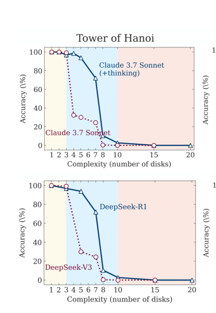
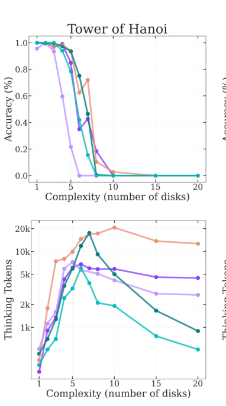
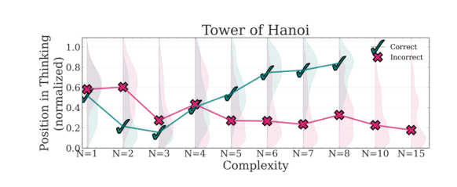

*paper: https://machinelearning.apple.com/research/illusion-of-thinking*  
The paper shows that the current Large Language Models(LLMs) and Large Reasoning Models (LRMs) experience a complete accuracy collapse on reasoning tasks after a threshold on complexity.   
This was demonstrated by using simple games like [Tower of Hanoi](https://en.wikipedia.org/wiki/Tower_of_Hanoi) and [River Crossing](https://en.wikipedia.org/wiki/River_crossing_puzzle). Via this paper the questions
>Are models capable for generalizable reasoning or are they just really good at pattern matching?
## The Setup
*love how simple the setup is*
Games like Tower of Hanoi 
- both simple to understand and require not knowledge other than the rules
- Are easy to verify both the complete and partial solutions
- The complexity of the problem can easily be controlled, (by say , the number of disks in Tower of Hanoi)
Now they just give the LLMs/LRMs the rules and ask them to solve them.  
**LLMs** -> Claude 3.7 Sonnet, Deepseek-R1,   
**LRMs(Thinking Models)** -> Claude 3.7 Thinking Mode, Deepseek-V3. (LRMs are trained with explicit Chain of Though reasoning data, or use Reinforcement Learning with verifiable rewards)  

## Their Findings
By changing the number of discs(n) the complexity of tasks is modified
- For low complexity tasks, both LLMs and LRMs show similar results, (with sometimes LLMs doing better)
- For medium complexity tasks, LRMs be better because of their *reasoning* capabilities.
- For high complexity tasks, the accuracy of both LLM and LRMs completely collapse to 0%.
- Additionally, even with exact algorithms in the prompts, the models fail to execute the algorithm.

- For thinking models, there is an increase in reasoning tokens as the complexity of problem increases
	- But after a certain threshold, it starts to decreases.
	- This point correlates with the point where accuracy collapses

- Analysis of the thinking tokens of the models also reveals the following
	- When the problems are simple, the model tends to find the solution in the initla part of the thinking
	- When the problems rise in complexity, the models tend to find the solution in later parts of the reasoning.

#### Data Contamination
The paper also highlights data contamination problem in the benchmarks often used to showcase a model's *intelligence*.
It points out: 
- The non thinking models eventually reach capability of thinking models
	- Evaluated using (pass@k)
- For benchmarks like AIME24, and AIME25, there is a difference between the scores of thinking and non thinking models.
- For AIME24 thinking models perform much better than non thinking ones, and this gap is even wider for AIME25. the paper points two possible scenaious:
	1. The test are more complex (but human perforance indicates that AIME24 is lower than AIME25)
	2. Reduced data contamination in the newer benchmarks
	

### Conclusion
- The paper demonstrates the limited ability of LLMs to reason after a certain point in complexity.
- They also show the inability of LLM/LRM in following exact algorithms.
While the paper introduces a really simple and quite interesting way of evaluating mode's capabilities, the evaluation task will probably fail to be a good metric as time goes on (I think). Because
>As soon as a metric becomes a target, it fails to be a good metric
